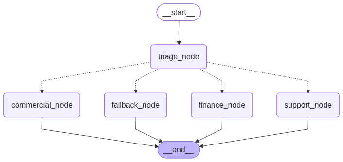

# 🤖 Ardael AI-Powered Smart Email Router Agent & Worker

A robust, enterprise-grade multi-node AI agent and worker built with **LangGraph** and the official **Google GenAI SDK**. The system automatically intercepts incoming customer emails from a real mailbox, extracts structured metadata, classifies intent, and routes execution to specialized Object-Oriented specialized agents (Finance, Support, Commercial) that consume localized knowledge bases to reply to customers with context-aware auto-responses.

This project evolved from a prototype script into a production-oriented, stateful architecture implementing advanced patterns for AI Orchestration, persistence, and secure email infrastructure.

---

## 🏗️ Architecture Overview

The core engine is a stateful graph where each node acts as a sandboxed operation, and transitions are governed by conditional edges based on the triage layer's structured analysis.

  

### Advanced Engineering Concepts Implemented

* **Stateful Memory & Persistence:** Integrated with `SqliteSaver`, amarrando o histórico de conversas do cliente através de uma `thread_id` dinâmica baseada no hash MD5 do remetente (`sender_email`). O uso de `Annotated[list, add_messages]` garante o acúmulo infinito de contexto sem sobrescrever dados.
* **Object-Oriented Agent Design (POO):** Cada setor especializado (Suporte, Financeiro, Comercial) foi encapsulado em classes independentes. Elas injetam dinamicamente manuais operacionais escritos em Markdown diretamente no System Prompt da LLM.
* **Structured Output Triaging:** O nó de roteamento força o modelo `gemini-1.5-flash` a obedecer a um esquema estrito do Pydantic (`EmailClassification`), mitigando falhas de parsing comuns em saídas de texto brutas.
* **Real Outbound/Inbound Infrastructure:** Módulos isolados de infraestrutura para comunicação externa via protocolos industriais padrão: **IMAP** para varredura e extração limpa de e-mails não lidos, e **SMTP (SSL)** para envio automatizado de respostas técnicas de volta para a internet.

---

## 🛠️ Tech Stack

* **Runtime/Language:** Python 3.12+
* **Agent Framework:** LangGraph (StateGraph & Pregel Engine)
* **LLM Provider:** Google Gemini API (`gemini-1.5-flash`)
* **Persistence Layer:** SQLite via `SqliteSaver`
* **Protocols/Infra:** IMAPLib & SMTPLib (Python Native Standard)
* **Data Validation:** Pydantic v2
* **Dependency Management:** `python-dotenv` & standard tools

---
🚀 Getting Started

Prerequisites

Certifique-se de possuir o ambiente virtual configurado e ativo (Python 3.12+).

Clone the Repository

git clone [https://github.com/natandavinci/langgraph-email-triage.git](https://github.com/natandavinci/langgraph-email-triage.git)
cd langgraph-email-triage

Install Dependencies

pip install langgraph google-genai pydantic python-dotenv

Configure Environment Variables

Crie um arquivo .env na raiz absoluta do projeto contendo as suas chaves e credenciais de e-mail (para contas Gmail, utilize uma Senha de App gerada nas configurações de segurança do Google):

GEMINI_API_KEY=sua_chave_gemini_aqui

# Configurações do Provedor de E-mail (IMAP/SMTP)
EMAIL_USER=seu_email_operacional@gmail.com
EMAIL_PASSWORD=sua_senha_de_aplicativo_aqui

📖 Key Lessons & Refactorings

1. O Mistério da Amnésia do Grafo (add_messages)

Refatorado o comportamento da chave history dentro do GraphState. Sem o decorator Annotated acoplado ao reducer add_messages, o ecossistema LangGraph opera de forma stateless, limpando memórias passadas. A implementação correta permitiu ao banco SQLite guardar e fornecer a linha do tempo exata de e-mails para cada cliente de forma isolada.

2. Blindagem de Assinaturas de Métodos Condicionais

Ajustado o método de decisão condicional do roteador (route_decision) utilizando propriedades @staticmethod e capturando ponteiros ocultos do compilador através de *args e kwargs. Isso sanou o erro de conflito de argumentos injetados pelo motor Pregel do LangGraph.

3. Encapsulamento de Nós via Funções lambda

Evitou-se o conflito de assinaturas internas de métodos homônimos (como .answer()) de instâncias distintas mapeadas no Grafo, utilizando clausuras lambda explícitas durante o registro em graph.add_node(), estabilizando a validação de nós de destino nas arestas condicionais.

🎯 Project Goals Achieved

Workflows de IA altamente determinísticos: Implementação prática e controle total de fluxo utilizando grafos de estado estruturados.

Engenharia de Software de nível corporativo: Padrões sólidos de produção com Programação Orientada a Objetos aplicada a Agentes.

RAG Local e Tomada de Ação: Consumo inteligente de manuais operacionais locais (.md) acoplados diretamente às respostas dos agentes especialistas.

Infraestrutura ponta a ponta real: Conexão direta e funcional com a rede de e-mails mundial utilizando protocolos industriais padrão (IMAP e SMTP).